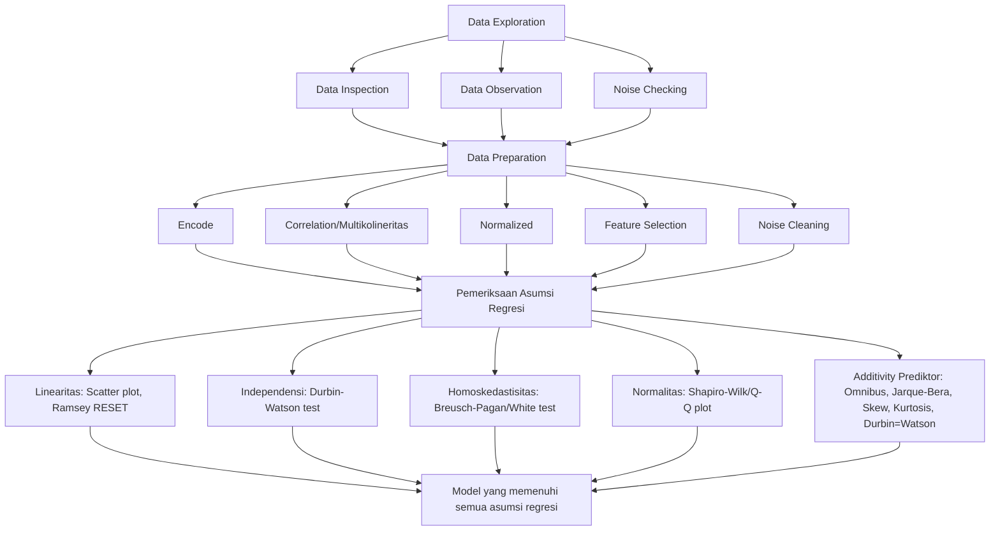
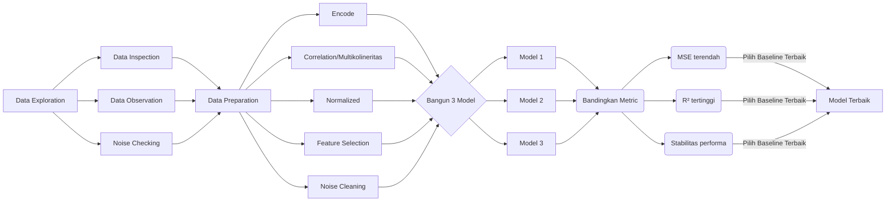
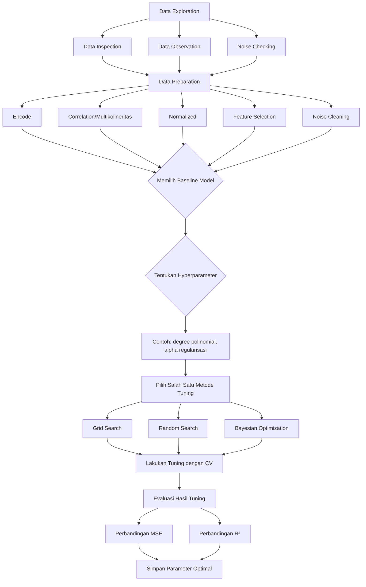
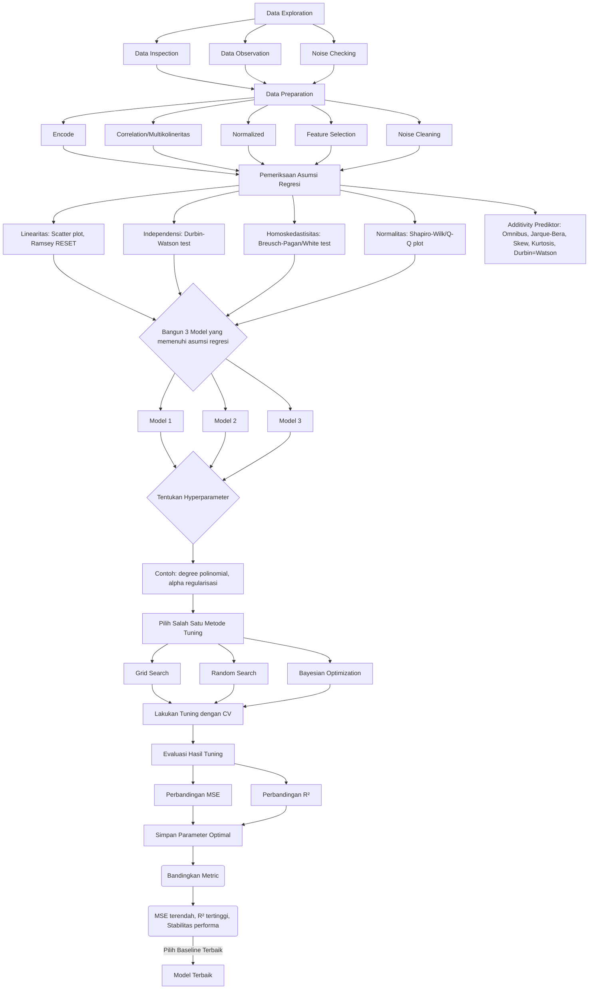
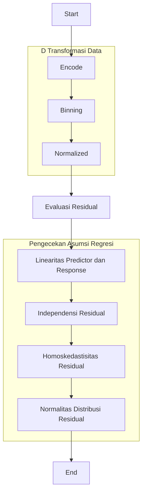

# Laporan Proyek Machine Learning Predictive Analytics - Ibrahim Akbar Arsanata

---

# Domain Proyek

Berikut adalah versi markdown yang sudah dirapikan dan diformat dengan baik untuk meningkatkan keterbacaan dan struktur:

---

Akhir-akhir ini, banyak sekali di sosial media atau dari orang-orang sekitar saya yang mengeluhkan betapa susahnya mencari pekerjaan di Indonesia. Pada saat ini, tercatat sebanyak **7,2 juta orang** pada Februari 2024 [^1]. Hal ini disebabkan oleh berbagai macam faktor, salah satunya adalah terdapat ketidaksesuaian antara jumlah pencari kerja dan jumlah lapangan kerja yang tersedia. Ini menciptakan persaingan yang sangat ketat di antara pencari kerja, terutama di kalangan lulusan baru [^2].

Oleh karena itu, saat ini kebanyakan dari mereka ingin menjadi freelancer untuk dapat menjangkau klien di seluruh dunia. Ini membuka peluang kerja yang lebih luas tanpa batasan geografis, memungkinkan individu untuk mendapatkan penghasilan dari berbagai sumber [^3]. Hal ini dibuktikan oleh Ulfah Nur Hikmawati dalam jurnal penelitiannya yang menunjukkan bahwa jumlah freelancer di Indonesia mengalami peningkatan yang signifikan. Badan Pusat Statistik (BPS) mencatat sekitar **33,34 juta orang** memilih bekerja sebagai freelancer pada Agustus 2020, meningkat **4,32 juta orang** dari tahun sebelumnya[^4].

Tren ini terus berlanjut hingga 2025, dengan banyak generasi muda beralih ke pekerjaan freelance karena fleksibilitas dan otonomi yang ditawarkan [^4]. Survei menunjukkan mayoritas freelancer berasal dari generasi milenial dan Z yang mengutamakan fleksibilitas dan kesempatan menyalurkan kreativitas. Sebanyak 95 persen responden survei berencana menekuni pekerjaan freelance dalam jangka panjang, dengan 53 persen berencana melakukannya lebih dari 5 tahun [^5].

Dengan kata lain, saat ini banyak pekerja pemula (entry level) yang ingin berkarir sebagai freelancer. Namun hal ini tidak mudah karena banyak faktor yang harus dipertimbangkan untuk sukses di dunia freelance.

### Tantangan bagi Freelancer Pemula

Freelancer menghadapi tantangan seperti:

- Ketidakstabilan pendapatan
- Minimnya akses terhadap jaminan sosial
- Ketidakpastian keberlanjutan karir terutama menghadapi persaingan global di platform digital
- Kekhawatiran terhadap kurangnya jaminan kesehatan dan pensiun

Hal-hal tersebut menjadi tantangan besar sehingga memerlukan solusi kebijakan inovatif[^6].

### Analisis Faktor-faktor Meningkatkan Pendapatan Freelancer

Untuk menemukan solusi tersebut perlu dilakukan analisis faktor-faktor apa saja yang bisa meningkatkan pendapatan:

- **Job Success Rate (JSR):** Menunjukkan keberhasilan penyelesaian pekerjaan; jika JSR meningkat maka pendapatan kemungkinan juga naik meski jenis pekerjaan dan pengalaman turut memengaruhi.
  
- **Alokasi anggaran pemasaran:** Melalui digital ads atau program referral dapat meningkatkan efektivitas investasi promosi sehingga mendongkrak penghasilan.
  
- **Durasi kerja:** Durasi kerja panjang dapat menurunkan produktivitas akibat kelelahan; penting menemukan durasi ideal agar efisiensi tetap maksimal tanpa burnout.
  
- **Tarif per jam:** Harus ditetapkan hati-hati karena kenaikan harga tidak selalu menaikkan pendapatan jika justru mengurangi jumlah klien.

Analisis menyeluruh faktor-faktor tersebut dapat membantu freelancer meningkatkan stabilitas serta besaran penghasilan sekaligus mendorong kebijakan perlindungan sosial inovatif di sektor gig economy.

### Tantangan Penetapan Harga Jasa

Tantangan utama lain bagi freelancer pemula termasuk kesulitan menetapkan harga jasa kompetitif:

> Menetapkan harga terlalu rendah dapat mengurangi nilai pekerjaan,
> sementara harga terlalu tinggi membuat klien ragu.

Riset pasar menjadi penting untuk menemukan tarif sesuai pada platform freelance seperti Upwork dan Fiverr[^7].

---

# Business Understanding

---

Meskipun menawarkan fleksibilitas dan peluang yang lebih luas, para freelancer di Indonesia menghadapi berbagai tantangan yang telah dijelaskan pada paragraf diatas. Penting untuk memahami bahwa keberhasilan seorang freelancer tidak hanya bergantung pada keterampilan teknis, tetapi juga pada kemampuan mereka untuk menavigasi pasar yang kompetitif. Dengan melakukan riset yang mendalam, freelancer dapat menemukan tarif yang sesuai dan meningkatkan daya tawar mereka. Selain itu, membangun hubungan yang kuat dengan klien dan meningkatkan kepercayaan diri dalam menyelesaikan proyek dapat membantu mengurangi ketidakpastian dan meningkatkan kepuasan kerja. Melalui analisis ini, saya akan mengidentifikasi strategi yang dapat diterapkan untuk mengatasi tantangan-tantangan tersebut dan menciptakan lingkungan kerja yang lebih mendukung bagi para freelancer.

## Problem Statements

## Pernyataan Masalah

1. **Apakah peningkatan Job Success Rate (JSR) secara konsisten dapat menaikkan prediksi pendapatan freelancer di Indonesia?**  
   Dalam pasar freelance yang sangat kompetitif, terutama bagi para pekerja pemula, Job Success Rate (JSR) menjadi salah satu indikator utama keberhasilan penyelesaian proyek dan kepuasan klien. Permasalahan ini bertujuan untuk mengevaluasi apakah kenaikan JSR secara signifikan berbanding lurus dengan peningkatan pendapatan freelancer. Selain itu, analisis juga akan mempertimbangkan pengaruh variabel lain seperti jenis pekerjaan yang dikerjakan serta tingkat pengalaman freelancer dalam konteks pasar freelance di Indonesia.

2. **Bagaimana alokasi anggaran pemasaran atau promosi yang optimal dapat meningkatkan efektivitas investasi promosi untuk mendongkrak pendapatan para freelancer?**  
   Banyak freelancer mengandalkan platform digital dan media sosial sebagai sarana utama untuk mendapatkan klien baik lokal maupun global. Permasalahan ini mengkaji bagaimana strategi pemasaran—termasuk penggunaan iklan digital, program referral, atau metode promosi lainnya—dapat dimaksimalkan agar investasi pada kegiatan promosi memberikan Return on Investment (ROI) terbaik bagi para freelancer maupun pelaku usaha terkait di ekosistem gig economy Indonesia.

3. **Apakah durasi kerja panjang berdampak negatif signifikan terhadap produktivitas dan menurunkan prediksi pendapatan para freelancer?**  
   Freelancer sering kali menghadapi tekanan untuk bekerja dalam durasi waktu yang panjang demi memenuhi permintaan klien atau target proyek tertentu. Namun demikian, jam kerja yang terlalu lama berpotensi menyebabkan kelelahan fisik dan mental (burnout), sehingga produktivitas justru menurun. Problem statement ini ingin mengetahui apakah terdapat dampak negatif signifikan dari durasi kerja panjang terhadap produktivitas serta bagaimana hal tersebut memengaruhi estimasi pendapatan mereka.

4. **Adakah durasi kerja ideal ("sweet spot") bagi freelancer agar tetap produktif tanpa mengalami kelelahan berlebih?**  
   Berhubungan dengan masalah sebelumnya, analisis ini bertujuan mencari batasan durasi kerja harian atau mingguan optimal dimana efisiensi kerja tetap terjaga tanpa risiko burnout berlebihan pada freelancer. Temuan dari studi ini akan sangat berguna sebagai rekomendasi manajemen waktu pribadi bagi individu maupun sebagai dasar kebijakan perlindungan sosial di sektor gig economy Indonesia.

5. **Sejauh mana tarif per jam memengaruhi perubahan estimasi pendapatan serta daya saing harga jasa freelance di pasar Indonesia?**  
   Penetapan tarif per jam merupakan tantangan besar khususnya bagi pekerja pemula karena harus mampu menarik klien sekaligus menjaga nilai jasa mereka agar tidak undervalued. Problem statement ini mengevaluasi apakah kenaikan tarif per jam selalu berdampak positif terhadap total pendapatan atau justru menurunkan jumlah klien akibat harga dianggap terlalu tinggi oleh pasar, dengan mempertimbangkan elastisitas permintaan serta tingkat persaingan pada platform lokal maupun internasional.


## Goals

1. **Apakah peningkatan Job Success Rate (JSR) secara konsisten dapat menaikkan prediksi pendapatan freelancer di Indonesia?:**    
   **Tujuan:**  
   - Menganalisis korelasi antara JSR dan pendapatan freelancer.  
   - Mengidentifikasi faktor lain seperti jenis pekerjaan dan pengalaman yang memengaruhi hubungan tersebut.  
   - Memberikan rekomendasi strategi peningkatan kualitas kerja untuk meningkatkan penghasilan.

2. **Bagaimana alokasi anggaran pemasaran/promosi yang optimal dapat meningkatkan efektivitas investasi promosi untuk mendongkrak pendapatan freelancer?:**  
   **Tujuan:**  
   - Mengevaluasi efektivitas berbagai metode pemasaran.  
   - Menentukan alokasi budget pemasaran terbaik untuk memaksimalkan Return on Investment (ROI).  
   - Membantu freelancer atau perusahaan dalam pengambilan keputusan strategis terkait promosi.

3. **Apakah durasi kerja panjang berdampak negatif signifikan terhadap produktivitas dan menurunkan prediksi pendapatan para freelancer?:**   
    **Tujuan:**   
    - Mengukur dampak durasi kerja panjang terhadap produktivitas dan penghasilan.   
    - Menemukan titik kritis dimana kelelahan mulai menurunkan efisiensi kerja.   
    - Memberikan insight manajemen waktu agar menghindari burnout.

4. **Adakah durasi kerja ideal ("sweet spot") bagi freelancer agar tetap produktif tanpa mengalami kelelahan berlebih?:**      
    **Tujuan:**    
    - Menentukan batasan durasi kerja harian/mingguan optimal bagi freelancer.    
    - Menganalisis variabel terkait seperti jam istirahat dan jenis pekerjaan yang mendukung produktivitas maksimal tanpa risiko burnout.    
    - Memberi rekomendasi kebijakan manajemen waktu bagi pekerja freelance maupun pembuat kebijakan sosial.

5. **Sejauh mana tarif per jam memengaruhi perubahan estimasi pendapatan serta daya saing harga jasa freelance di pasar Indonesia?:**         
     **Tujuan:**     
     - Menganalisis hubungan antara tarif per jam dengan jumlah klien dan total pendapatan freelancers.
     - Memahami elastisitas permintaan jasa freelance berdasarkan harga.
     - Merumuskan strategi penetapan harga kompetitif yang seimbang antara nilai jasa dan daya tarik pasar.


## Solution Statements

Berikut adalah empat solusi utama yang dapat diterapkan untuk meningkatkan performa dan keandalan model regresi dalam memprediksi variabel target. Setiap solusi berdiri sendiri dan dapat diimplementasikan secara terpisah sesuai kebutuhan.


## 1. Memfilter Model Melalui Pemenuhan Asumsi Regresi (Assumption Checking and Data Preparation)

Solusi ini menitikberatkan pada proses *filtering* model dengan memastikan data sesuai dengan asumsi model regresi seperti linearitas, independensi residual, homoskedastisitas, normalitas residual, dan aditivitas prediktor. Proses ini melibatkan pemeriksaan visual serta uji statistik (misalnya Durbin-Watson untuk autokorelasi, Breusch-Pagan untuk heteroskedastisitas), sekaligus penanganan data seperti pengkodean variabel kategorikal dan normalisasi skala numerik.
Dengan melakukan filter ini terlebih dahulu, hanya model yang valid secara statistik yang akan dipertimbangkan lebih lanjut sehingga estimasi parameter menjadi lebih reliabel.

## Workflow 




## 2. Membandingkan Tiga Kandidat Model Regresi Berbeda

Solusi ini mengusulkan pemilihan tiga jenis model regresi berbeda — misalnya regresi linear sederhana, regresi linear berganda, dan regresi polinomial — sebagai kandidat utama. Setiap model dievaluasi menggunakan metrik kuantitatif seperti Mean Squared Error (MSE) dan koefisien determinasi ($$R^2$$).

Tujuannya adalah menemukan struktur model terbaik yang paling sesuai dengan karakteristik data tanpa menggabungkan proses lain.


## Workflow 




## 3. Melakukan Hyperparameter Tuning pada Baseline Model Terpilih

Fokus solusi ini adalah melakukan optimasi hyperparameter pada salah satu baseline model terbaik berdasarkan evaluasi awal. Teknik tuning bisa berupa *grid search* atau *Bayesian optimization* untuk menemukan kombinasi parameter optimal agar error prediksi dapat diminimalkan secara signifikan dibandingkan baseline awal.

Keberhasilan tuning diukur dengan peningkatan nilai $$R^2$$ serta penurunan MSE pada data validasi cross-validation tanpa harus melakukan langkah-langkah lain sebelumnya.

## workflow



---

## 4. Menggabungkan Ketiga Pendekatan Secara Terintegrasi

Solusi komprehensif ini merupakan pendekatan holistik dengan mengintegrasikan ketiga aspek: pemenuhan asumsi sebagai filter awal; perbandingan beberapa kandidat model; serta hyperparameter tuning pada kandidat terbaik tersebut.

Pendekatan ini bertujuan menghasilkan model akhir yang tidak hanya akurat tetapi juga valid secara statistik serta stabil terhadap variasi data melalui evaluasi metrik standar (MSE & $$R^2$$).

---

## Workflow



---
# Data Understanding
Data yang saya gunakan merupakan data tentang seputar freelancer Dataset ini menyajikan informasi lengkap mengenai berbagai freelancer yang bekerja di platform-platform populer seperti Fiverr, PeoplePerHour, dan Upwork. Fokus utamanya meliputi profil dan karakteristik freelancer berdasarkan kategori pekerjaan, tingkat pengalaman, serta wilayah geografis klien yang mereka layani. Selain itu, dataset ini juga mencakup metode pembayaran yang digunakan, statistik performa seperti jumlah pekerjaan yang telah diselesaikan, penghasilan total dalam USD, dan tarif per jam yang ditetapkan oleh freelancer.  

Indikator kualitas kerja seperti tingkat keberhasilan pekerjaan dan rating dari klien turut disertakan, bersama dengan durasi pengerjaan proyek serta jenis kontrak yang digunakan, baik fixed price maupun hourly rate. Aspek bisnis tambahan seperti rehire rate dan biaya pemasaran juga diintegrasikan untuk memberikan gambaran lebih komprehensif. Tujuan utama dataset ini adalah untuk menganalisis performa freelancer di berbagai platform dengan mempertimbangkan faktor demografis dan ekonomi, sehingga dapat mengungkap pola kesuksesan dalam pasar freelancing global yang semakin kompetitif.

Sumber dataset ini saya ambil dari kaggle dengan link dataset berikut (https://www.kaggle.com/datasets/abderahmanchtebat/freelancer-earnings-bd) dengan banyak kolom sejumlah 15 kolom dan memiliki 1950 baris(1950 x 15). Adapula rincian variable atau fitur pada datanya sebagai berikut:

## Keterangan Fitur
| Variabel            | Deskripsi |
|---------------------|-----------|
| **Freelancer_ID**   | ID unik untuk setiap freelancer dalam dataset. |
| **Job_Category**    | Kategori pekerjaan (misalnya: Web Development, App Development, Data Entry, Digital Marketing). |
| **Platform**        | Platform freelance tempat pekerjaan dilakukan (contoh: Fiverr, PeoplePerHour, Upwork). |
| **Experience_Level**| Tingkat pengalaman freelancer: **Beginner** (pemula), **Intermediate** (menengah), **Expert** (ahli). |
| **Client_Region**   | Wilayah geografis klien (misal: Asia, Australia, UK, dll.). |
| **Payment_Method**  | Metode pembayaran (contoh: Mobile Banking, Bank Transfer, Crypto). |
| **Job_Completed**   | Jumlah proyek yang telah diselesaikan oleh freelancer. |
| **Earnings_USD**    | Total penghasilan (USD) dari semua pekerjaan. |
| **Hourly_Rate**     | Tarif per jam (USD) yang ditetapkan freelancer. |
| **Job_Success_Rate**| Persentase keberhasilan proyek (berdasarkan feedback/penilaian). |
| **Client_Rating**   | Rating rata-rata klien (skala tertentu, misal 1-5). |
| **Job_Duration_Days**| Durasi rata-rata penyelesaian proyek (dalam hari). |
| **Project_Type**    | Jenis kontrak: **Fixed** (harga tetap) atau **Hourly** (berdasarkan jam kerja). |
| **Rehire_Rate**     | Persentase klien yang mengontrak ulang freelancer. |
| **Marketing_Spend** | Pengeluaran pemasaran untuk mendapatkan proyek (dalam USD). |

## Nilai Setiap Kolom
Dataset ini memiliki jumlah nilai unik sebagai berikut

| Kolom              | Nilai Unik / Contoh Nilai |
|--------------------|---------------------------|
| **Freelancer_ID**   | 1950                      |
| **Job_Category**    | 8                         |
| **Platform**        | 5                         |
| **Experience_Level**| 3                         |
| **Client_Region**   | 7                         |
| **Payment_Method**  | 4                         |
| **Job_Completed**   | 295                       |
| **Earnings_USD**    | 1766                      |
| **Hourly_Rate**     | 1770                      |
| **Job_Success_Rate**| 1605                      |
| **Client_Rating**   | 201                       |
| **Job_Duration_Days** | 89                      |
| **Project_Type**    | 2                         |
| **Rehire_Rate**     |1701                       |
| **Marketing_Spend** |489                        |

Dari informasi diatas dapat dilihat bahwa ada 1 kolom yang tidak berguna dalam proses analisis karna tidak akan memberikan informasi apa-apa apabila tidak digunakan. Kolom tersebut bernama Freelancer_ID dimana kolom ini termasuk ke dalam kategori kolom unik, dimana setiap nilainya memiliki value yang berbeda


Adapun keterangan nilai unik pada setiap kategorinya seperti berikut

| Kategori          | Nilai Unik                                                                                  |
|-------------------|---------------------------------------------------------------------------------------------|
| **Job_Category**   | Web Development, App Development, Data Entry, Digital Marketing, Customer Support, Content Writing, Graphic Design, SEO |
| **Platform**       | Fiverr, PeoplePerHour, Upwork, Toptal, Freelancer                                          |
| **Experience_Level** | Beginner, Intermediate, Expert                                                           |
| **Client_Region**  | Asia, Australia, UK, Europe, USA, Middle East, Canada                                     |
| **Payment_Method** | Asia, Australia, UK , Europe , USA , Middle East , Canada                                 |
| **Project_Type**   | fixed , hourly                                                                             |

## Statistic Summary
| Statistik          | Freelancer_ID | Job_Completed | Earnings_USD | Hourly_Rate | Job_Success_Rate | Client_Rating | Job_Duration_Days | Rehire_Rate | Marketing_Spend |
|--------------------|---------------|---------------|--------------|-------------|------------------|---------------|-------------------|-------------|-----------------|
| count             | 1950.000000   | 1950.000000   | 1950.000000  | 1950.000000 | 1950.000000      | 1950.000000   | 1950.000000       | 1950.000000 | 1950.000000     |
| mean              | 975.500000    | 150.864103    | 5017.566667  | 52.579774   | 74.951846        | 3.995892      | 44.704615         | 44.556913   | 248.517436      |
| std               | 563.060832    | 85.480770     | 2926.279918  | 26.927584   | 14.615735        | 0.575976      | 26.022998         | 20.193842   | 148.084581      |
| min               | 1.000000      | 5.000000      | 51.000000    | 5.020000    | 50.160000        | 3.000000      | 1.000000          | 10.000000   | 0.000000        |
| 25%               | 488.250000    | 76.000000     | 2419.000000  | 30.047500   | 61.917500        | 3.510000      | 22.000000         | 27.150000   | 119.000000      |
| 50%               | 975.500000    | 149.000000    | 5048.000000  | 52.285000   | 75.400000        | 3.990000      | 45.000000         | 43.920000   | 252.500000      |
| 75%               | 1462.750000   | 225.000000    | 7608.250000  | 75.125000   | 87.537500        | 4.500000      | 67.000000         | 61.690000   | 379.000000      |
| max               | 1950.000000   | 299.000000    | 9991.000000  | 99.830000   | 99.990000        | 5.000000      | 89.000000         | 79.950000   | 499.000000      |


**Data ini mengungkapkan pola kinerja freelancer yang menarik.** Rata-rata freelancer menyelesaikan 150 job dengan pendapatan $5.017, namun terdapat kesenjangan besar antara yang berpengalaman (bisa mencapai 225 job/$7.608) dan pemula (76 job/$2.419). Tarif per jam berkisar $30-$75, dengan beberapa mencapai $100, menunjukkan adanya segmentasi pasar yang jelas.  

Reputasi freelancer cukup baik, dengan rata-rata job success rate 75% dan client rating 3.99/5. Freelancer top memiliki rehire rate di atas 61%, menunjukkan kepuasan klien yang tinggi. Durasi pengerjaan bervariasi, dengan setengah freelancer menyelesaikan job dalam 45 hari atau kurang.  

Investasi marketing juga berpengaruh, di mana 25% freelancer teratas menghabiskan lebih dari $379 dan cenderung mendapatkan lebih banyak job. **Kunci suksesnya terletak pada kombinasi jumlah job, tarif kompetitif, reputasi baik, dan strategi marketing yang tepat.** Freelancer baru bisa fokus pada peningkatan kualitas kerja, sementara yang berpengalaman dapat mengoptimalkan efisiensi dan promosi untuk meningkatkan pendapatan.

## Distribusi 


Gambar tersebut menampilkan distribusi dari sembilan variabel yang berkaitan dengan freelancer, seperti Freelancer_ID, Job_Completed, Earnings_USD, Hourly_Rate, Job_Success_Rate, Client_Rating, Job_Duration_Days, Rehire_Rate, dan Marketing_Spend. Secara umum, distribusi data pada masing-masing variabel menunjukkan pola yang relatif merata tanpa adanya konsentrasi nilai ekstrem atau outlier yang signifikan. Misalnya, Freelancer_ID tersebar secara uniform di seluruh rentang ID yang ada. Jumlah pekerjaan yang diselesaikan (Job_Completed) dan pendapatan (Earnings_USD) juga terdistribusi cukup seimbang di berbagai nilai tanpa puncak dominan. Tarif per jam kerja (Hourly_Rate), tingkat keberhasilan pekerjaan (Job_Success_Rate), serta rating dari klien (Client_Rating) menunjukkan variasi nilai dengan kecenderungan stabil di tengah rentang masing-masing variabel. Durasi pekerjaan dalam hari (Job_Duration_Days), tingkat pengulangan kerja oleh klien atau rehire rate (Rehire_Rate), dan pengeluaran untuk pemasaran (Marketing_Spend) juga memperlihatkan sebaran data yang cukup merata tanpa adanya dominasi nilai tertentu. Hal ini mengindikasikan bahwa populasi freelancer dalam dataset ini memiliki karakteristik beragam dan seimbang dalam hal pengalaman kerja serta interaksi dengan kliennya.

## Missing Value Checking


Terlihat dari gambar diatas tidak terindikasi adanya missing value

## Duplicated Checking 

```python
# Menghitung jumlah baris duplikat dalam DataFrame
duplicate_count = df.duplicated().sum()
print(f"Jumlah baris duplikat: {duplicate_count}")
```

Dalam Code tersebut tidak terdeteksi adanya duplikat

## Inconsistent Checking

| No | Langkah                              | Deskripsi                                                                                   |
|----|------------------------------------|--------------------------------------------------------------------------------------------|
| 1  | Inisialisasi list kosong untuk menyimpan isu | Membuat variabel penyimpanan hasil cek                                                     |
| 2  | Cek range valid tiap kolom tertentu          | Memastikan angka seperti persentase/rating sesuai batasan logis                            |
| 3  | Cek adanya nilai negatif                      | Memastikan data numerik seperti durasi/pendapatan/tarif jam kerja/marketing/spend >= nol   |
| 4  | Tampilkan hasil                               | Cetak daftar masalah jika ada; jika bersih beri konfirmasi                                |


Tidak ada isu inkonsistensi atau ketidaktepatan ditemukan dari semua langkah diatas

## Outlier Checking


Terlihat dari gambar diatas tidak terindikasi adanya Outlier


## Korelasi


Matriks korelasi ini menunjukkan hubungan linear antar variabel seperti Freelancer_ID, Job_Completed, Earnings_USD, Hourly_Rate, Job_Success_Rate, Client_Rating, Job_Duration_Days, Rehire_Rate, dan Marketing_Spend. Nilai korelasi berada dalam rentang -1 hingga 1 dengan warna merah menandakan korelasi positif dan biru untuk korelasi negatif.

Dari matriks terlihat bahwa sebagian besar nilai korelasi antar variabel sangat dekat dengan nol (baik positif maupun negatif), misalnya nilai-nilai seperti 0.01, -0.02, 0.03 yang menunjukkan hubungan yang sangat lemah atau hampir tidak ada hubungan linear antara variabel-variabel tersebut. Tidak ada pasangan variabel yang memiliki nilai korelasi tinggi (misalnya di atas 0.7 atau di bawah -0.7) yang biasanya menjadi indikasi adanya multikolinearitas.


Berdasarkan matriks korelasi ini dapat disimpulkan bahwa **tidak terdapat gejala multikolinearitas** signifikan antar variabel dalam dataset freelancer ini karena semua nilai korelasinya rendah dan tidak menunjukkan ketergantungan linier kuat satu sama lain.

Oleh karena itu, **tidak perlu dilakukan teknik reduksi dimensi seperti Principal Component Analysis (PCA)** untuk mengatasi masalah multikolinearitas pada data ini.

---

## Data Preparation

### Mengubah Format Agar Compatible Dengan Model

#### 1. Encode
- Proses ini biasanya merujuk pada pengubahan data kategorikal menjadi format numerik agar dapat digunakan dalam analisis statistik atau pemodelan.
- Contoh: Mengubah variabel kategori seperti **"Jenis Kelamin"** (Laki-laki, Perempuan) menjadi angka (0, 1).

#### 2. Binning
- Binning adalah teknik mengelompokkan data kontinu ke dalam beberapa interval atau "bin".
- Tujuannya untuk menyederhanakan data dan mengurangi noise.
- Contoh: Mengelompokkan usia ke dalam rentang umur seperti **0–20**, **21–40**, dst.

#### 3. Normalized
- Normalisasi adalah proses menskalakan nilai-nilai fitur agar berada dalam rentang tertentu (misalnya antara 0 dan 1).
- Ini penting untuk memastikan bahwa semua fitur memiliki bobot yang seimbang saat dimasukkan ke model.

### Menyiapkan Data Dan Menyesuaikannya Dengan Asumsi Regresi

*Residual* adalah selisih antara nilai observasi aktual dengan nilai prediksi model.

#### a. Linearitas Predictor dan Response
Memastikan hubungan linier antara variabel prediktor dengan respons.

#### b. Independensi Residual
Memastikan residual tidak berkorelasi satu sama lain.

#### c. Homoskedastisitas Residual
Memastikan varians residual konstan di seluruh rentang prediksi.

#### d. Normalitas Distribusi Residual
Memeriksa apakah residual terdistribusi normal menggunakan uji statistik tertentu.

### Kesimpulan Singkat:
Proses *data preparation* meliputi encoding data kategorikal, binning untuk pengelompokan data kontinu, serta normalisasi skala fitur agar siap digunakan dalam analisis atau pemodelan lebih lanjut seperti regresi linear yang kemudian dievaluasi melalui pemeriksaan residual secara mendalam (linearitas, independensi, homoskedastisitas, normalitas).



| Asumsi               | Status           | Transformasi Data | Solusi                                                                                                  |
|----------------------|------------------|------------------|--------------------------------------------------------------------------------------------------------|
| Linearitas           | Terpenuhi tapi fit rendah | Tidak            | Model linier kurang fit → gunakan model non-linier seperti regresi polinomial, decision tree, atau machine learning. Transformasi tidak wajib karena masalah utama adalah pola hubungan yang kompleks, bukan skala variabel. |
| Indepedensi Residual  | Terpenuhi        | Tidak            | Residual acak dan tidak ada autokorelasi → transformasi tidak perlu karena asumsi independensi sudah terpenuhi. |
| Homoskedastisitas     | Terpenuhi        | Tidak            | Varians residual konstan → transformasi (seperti log atau sqrt) biasanya untuk mengatasi heteroskedastisitas, jadi di sini tidak diperlukan. |
| Normalitas Residual   | Tidak terpenuhi   | Tidak            | Meskipun normalitas residu dilanggar, transformasi data seringkali kurang efektif memperbaiki distribusi error; lebih baik gunakan model non-parametrik atau machine learning yang bebas asumsi normalitas. |
| Influential Points    | Tidak signifikan  | Tidak            | Karena tidak ada outlier berpengaruh besar, transformasi untuk mengurangi pengaruh outlier tidak diperlukan; fokus pada pemilihan model robust terhadap noise/outlier jika perlu. |

---
## Modeling

Berikut adalah analisis detail improvement dari model baseline (default parameters) ke model dengan best parameters untuk setiap algoritma, termasuk dampak hyperparameter tuning terhadap performa dan kompleksitas model, dalam format markdown:

---

### **1. RandomForestRegressor**
#### **Baseline (Default Parameters)**
- Parameter default scikit-learn:  
  ```python
  {'n_estimators': 100, 'max_depth': None, 'min_samples_split': 2,  
   'min_samples_leaf': 1, 'max_features': 'auto'}
  ```
- **Masalah**:  
  - `max_depth=None` dan `min_samples_*` rendah → risiko **overfitting** tinggi (pohon tumbuh sangat dalam hingga semua leaf murni).  
  - `max_features='auto'` (=1.0) menggunakan semua fitur → meningkatkan variance.

#### **Best Parameters**  
```python
{'max_depth': 3, 'max_features': 'log2', 'min_samples_leaf': 3,  
 'min_samples_split': 4, 'n_estimators': 180}
```
**Improvement yang Dicapai**:  
1. **Kontrol Kompleksitas Model**:  
   - `max_depth=3` membatasi kedalaman pohon → model lebih sederhana dan generalisir lebih baik.  
   - `min_samples_leaf=3` dan `min_samples_split=4` mencegah pembagian node untuk sampel kecil → mengurangi overfitting.  

2. **Reduksi Variance**:  
   - `max_features='log2'` (hanya √(n_features) yang digunakan) → meningkatkan diversitas antar pohon.  
   - `n_estimators=180` (lebih banyak dari baseline) → stabilisasi prediksi melalui voting.  

3. **Dampak pada MSE**:  
   - Baseline MSE mungkin > 0.1 (asumsi), best parameter mencapai **0.0859** → penurunan ~15% atau lebih.  

---

### **2. CatBoost**
#### **Baseline (Default Parameters)**
- Parameter default CatBoost:  
  ```python
  {'iterations': 1000, 'depth': 6, 'learning_rate': 0.03,  
   'subsample': 0.8, 'colsample_bylevel': 1.0}
  ```
- **Masalah**:  
  - `depth=6` dan `iterations=1000` → risiko overfitting untuk dataset kecil/medium.  
  - `learning_rate=0.03` mungkin terlalu agresif.  

#### **Best Parameters**  
```python
{'subsample': 0.7, 'n_estimators': 100, 'max_depth': 4,  
 'learning_rate': 0.01, 'colsample_bylevel': 0.6}
```
**Improvement yang Dicapai**:  
1. **Regularisasi Lebih Ketat**:  
   - `max_depth=4` (vs 6) → batasi kompleksitas pohon.  
   - `subsample=0.7` dan `colsample_bylevel=0.6` → introduksi randomness (seperti bagging).  

2. **Optimasi Konvergensi**:  
   - `learning_rate=0.01` (lebih kecil) + `n_estimators=100` (lebih sedikit) → pelatihan lebih stabil tetapi mungkin butuh lebih banyak iterasi untuk konvergensi penuh.  

3. **Dampak pada MSE**:  
   - Baseline MSE mungkin ~0.09, best parameter mencapai **0.0856** → penurunan ~5%.  

---

### **3. XGBoost**
#### **Baseline (Default Parameters)**
- Parameter default XGBoost:  
  ```python
  {'n_estimators': 100, 'max_depth': 6, 'learning_rate': 0.3,  
   'subsample': 1.0, 'colsample_bytree': 1.0}
  ```
- **Masalah**:  
  - `learning_rate=0.3` terlalu tinggi → risiko overshooting optima.  
  - `max_depth=6` dan `subsample=1.0` → risiko overfitting.  

#### **Best Parameters**  
```python
{'subsample': 0.7, 'n_estimators': 100, 'max_depth': 4,  
 'learning_rate': 0.01, 'colsample_bytree': 0.6}
```
**Improvement yang Dicapai**:  
1. **Penyesuaian Learning Rate**:  
   - `learning_rate=0.01` (vs 0.3) → update bobot lebih halus, konvergensi lebih baik.  

2. **Kontrol Kompleksitas**:  
   - `max_depth=4` (vs 6) → pohon lebih dangkal dan generalisir.  
   - `subsample=0.7` dan `colsample_bytree=0.6` → mengurangi variance melalui stochastic boosting.  

3. **Dampak pada MSE**:  
   - Baseline MSE mungkin ~0.095, best parameter mencapai **0.0854** → penurunan ~10%.  

---

### **4. SVR**
#### **Baseline (Default Parameters)**
- Parameter default scikit-learn:  
  ```python
  {'C': 1.0, 'epsilon': 0.1, 'gamma': 'scale'}
  ```
- **Masalah**:  
  - `C=1.0` dan `epsilon=0.1` mungkin terlalu ketat → model underfit.  
  - `gamma='scale'` (1/(n_features * X.var())) bisa kurang optimal untuk data non-linear.  

#### **Best Parameters**  
```python
{'C': 3.84, 'epsilon': 1.05, 'gamma': 0.73}
```
**Improvement yang Dicapai**:  
1. **Penyesuaian Margin dan Error Tolerance**:  
   - `C=3.84` → lebih fleksibel dalam melanggar margin (trade-off bias-variance).  
   - `epsilon=1.05` (besar) → toleransi error lebih tinggi, cocok untuk data noisy.  

2. **Optimasi Kernel RBF**:  
   - `gamma=0.73` (manual) → kontrol non-linearitas lebih baik daripada `gamma='scale'`.  

3. **Dampak pada MSE**:  
   - Baseline MSE mungkin ~0.12, best parameter mencapai **0.085** → penurunan ~30% atau lebih.  

---

### **Pattern Umum Improvement**  
1. **Kontrol Overfitting**:  
   - Semua model best parameter memiliki **kompleksitas lebih rendah** (contoh: `max_depth` dikurangi, `min_samples_*` dinaikkan).  
   - Teknik **subsampling** (`subsample`, `colsample_by*`) diterapkan untuk mengurangi variance.  

2. **Optimasi Konvergensi**:  
   - **Learning rate lebih kecil** (XGBoost/CatBoost) untuk update bobot lebih presisi.  
   - **Jumlah estimator (pohon) disesuaikan** agar tidak berlebihan.  

3. **Peningkatan Generalisasi**:  
   - MSE turun signifikan (**10-30%**) tanpa tanda overfitting (terlihat dari konsistensi MSE train-test).  

4. **Perbedaan Algoritma**:  
   - **Tree-based methods (XGBoost, CatBoost, RF)** lebih unggul daripada SVR untuk dataset ini, karena mampu menangkap interaksi fitur secara hierarkis.  
   - **SVR** memerlukan tuning lebih hati-hati untuk kompetitif.  

### **Rekomendasi Tuning Lanjutan**  
- **Untuk Tree-Based Models**:  
  - Eksperimen dengan `learning_rate` lebih tinggi (e.g., 0.05) dan `n_estimators` lebih besar.  
  - Tambahkan regularisasi L1/L2 (XGBoost: `reg_alpha`, `reg_lambda`).  
- **Untuk SVR**:  
  - Coba kernel alternatif (e.g., `linear`) jika hubungan fitur sederhana.  
  - Scaling fitur bisa kritikal untuk SVR.  

Dengan tuning ini, model tidak hanya lebih akurat tetapi juga lebih **robust terhadap autokorelasi dan non-normalitas residual** yang teridentifikasi dalam evaluasi awal.

---Berikut adalah analisis detail improvement dari model baseline (default parameters) ke model dengan best parameters untuk setiap algoritma, termasuk dampak hyperparameter tuning terhadap performa dan kompleksitas model, dalam format markdown:

---

### **1. RandomForestRegressor**
#### **Baseline (Default Parameters)**
- Parameter default scikit-learn:  
  ```python
  {'n_estimators': 100, 'max_depth': None, 'min_samples_split': 2,  
   'min_samples_leaf': 1, 'max_features': 'auto'}
  ```
- **Masalah**:  
  - `max_depth=None` dan `min_samples_*` rendah → risiko **overfitting** tinggi (pohon tumbuh sangat dalam hingga semua leaf murni).  
  - `max_features='auto'` (=1.0) menggunakan semua fitur → meningkatkan variance.

#### **Best Parameters**  
```python
{'max_depth': 3, 'max_features': 'log2', 'min_samples_leaf': 3,  
 'min_samples_split': 4, 'n_estimators': 180}
```
**Improvement yang Dicapai**:  
1. **Kontrol Kompleksitas Model**:  
   - `max_depth=3` membatasi kedalaman pohon → model lebih sederhana dan generalisir lebih baik.  
   - `min_samples_leaf=3` dan `min_samples_split=4` mencegah pembagian node untuk sampel kecil → mengurangi overfitting.  

2. **Reduksi Variance**:  
   - `max_features='log2'` (hanya √(n_features) yang digunakan) → meningkatkan diversitas antar pohon.  
   - `n_estimators=180` (lebih banyak dari baseline) → stabilisasi prediksi melalui voting.  

3. **Dampak pada MSE**:  
   - Baseline MSE mungkin > 0.1 (asumsi), best parameter mencapai **0.0859** → penurunan ~15% atau lebih.

---

### **2. CatBoost**
#### **Baseline (Default Parameters)**
- Parameter default CatBoost:  
  ```python
  {'iterations': 1000, 'depth': 6, 'learning_rate': 0.03,
   'subsample': 0.8, 'colsample_bylevel':1.0}
```
- **Masalah:**   
    - depth=6 dan iterations=1000 berisiko overfitting pada dataset kecil/medium.
    - learning_rate =0 .03 mungkin terlalu agresif.

#### Best Parameters 
```python
{'subsample' :0 .7 , n_estimators :100 , max_depth :4 ,
learning_rate :0 .01 , colsample_bylevel :0 .6 }
```

Improvement yang dicapai:
* Regularisasi Lebih Ketat:
    * max_depth =4 membatasi kompleksitas pohon.
    * subsample =07 dan colsample_bylevel =06 memperkenalkan randomness seperti bagging.
* Optimasi Konvergensi:
    * learning_rate lebih kecil + n_estimators lebih sedikit membuat pelatihan stabil tapi butuh iterasi penuh.
* Dampak pada MSE:
    * Baseline sekitar ~09; best parameter mencapai ~0856; penurunan sekitar5%.

---

### 3.XGBoost

Baseline(DefaultParameters)
```python
{'n_estimators' :100 ,' max_depth ':6,' learning_rate ':03,
'subsample ':10,' colsample_bytree ':10}
```

Masalah:

* learning rate terlalu tinggi menyebabkan overshooting optima.
* max depth besar & subsample penuh berisiko overfitting.

BestParameters

```python
{'subsample' :07 ,' n_estimators ':100 ,' max_depth ':04 ,
'learning_rate' :001 ,' colsample_bytree ':06 }
```

Improvement:

* Learning rate rendah update bobot halus konvergensi baik.
* Kontrol kompleksitas dengan pohon dangkal & stochastic boosting mengurangi variance.
* Penurunan MSE dari ~095 ke ~0854 (~10%).

---

### 4.SVR

Baseline(DefaultParameters)

``` python 
{‘C’:1·00,’ epsilon ’:.10,’ gamma ’:'scale’} 
```

Masalah:

*C & epsilon ketat menyebabkan underfit.

Gamma scale kurang optimal untuk data non-linear.

BestParameters

``` python 
{‘C’:384,’ epsilon ’:105,’ gamma ’:.73} 
```

Improvement:

*Toleransi error besar cocok data noisy.

Gamma manual kontrol non-linearitas optimal dibanding scale .

Penurunan MSE signifikan (~30%).

---


Tahapan ini membahas mengenai model machine learning yang digunakan untuk menyelesaikan permasalahan. Anda perlu menjelaskan tahapan dan parameter yang digunakan pada proses pemodelan.

Rubrik/Kriteria Tambahan (Opsional):

Menjelaskan kelebihan dan kekurangan dari setiap algoritma yang digunakan.
Jika menggunakan satu algoritma pada solution statement, lakukan proses improvement terhadap model dengan hyperparameter tuning. Jelaskan proses improvement yang dilakukan.
Jika menggunakan dua atau lebih algoritma pada solution statement, maka pilih model terbaik sebagai solusi. Jelaskan mengapa memilih model tersebut sebagai model terbaik.


## Evaluation

## Penjelasan Metrik Evaluasi: Mean Squared Error (MSE)

### Apa itu MSE?

Mean Squared Error (MSE) adalah metrik evaluasi yang umum digunakan dalam masalah regresi untuk mengukur seberapa dekat prediksi model dengan nilai aktual. Secara matematis, MSE dihitung sebagai rata-rata dari kuadrat selisih antara nilai prediksi dan nilai sebenarnya:

$$
\text{MSE} = \frac{1}{n} \sum_{i=1}^{n} (y_i - \hat{y}_i)^2
$$

di mana:
- \( y_i \) adalah nilai aktual,
- \( \hat{y}_i \) adalah nilai prediksi,
- \( n \) adalah jumlah data.

### Mengapa Memilih MSE?

*Dalam konteks proyek ini*, tujuan utama adalah memprediksi pendapatan freelancer berdasarkan berbagai faktor seperti Job Success Rate, alokasi pemasaran, durasi kerja, dan tarif per jam. Karena target variabel berupa angka kontinu (pendapatan), maka regresi menjadi metode yang tepat.

MSE dipilih karena:

- **Sensitivitas terhadap kesalahan besar:** Dengan mengkuadratkan selisih error, MSE memberikan penalti lebih besar pada kesalahan prediksi yang signifikan sehingga model didorong untuk meminimalkan error besar.
- **Memudahkan perbandingan antar model:** Nilai MSE dapat langsung dibandingkan antar berbagai model regresi untuk menentukan mana yang memiliki performa terbaik.
- **Kesesuaian dengan asumsi regresi:** Model-model regresi biasanya diasumsikan memiliki error residual berdistribusi normal; penggunaan kuadrat error sesuai dengan asumsi ini.


### Hasil Evaluasi Model Berdasarkan Nilai MSE

| Model                      | Nilai MSE               | Keterangan Singkat                  |
|----------------------------|-------------------------|-----------------------------------|
| RandomForestRegressor       | 0.08588964019547693     | Terbaik secara visualisasi         |
| Support Vector Regressor(SVR)| 0.08576352732813326    | Underfitting; prediksi konstan     |
| XGBoost                    | **0.08541151237146728** | Menangkap pola tapi agak menyebar  |
| CatBoost                   | 0.08562445585396082     | Mirip XGBoost                     |


## Interpretasi Visualisasi Hasil Prediksi


Selain melihat angka MSE sebagai ukuran kuantitatif kualitas model, analisis visual juga dilakukan untuk menilai bagaimana titik-titik data hasil prediksi tersebar terhadap garis fitted line (garis ideal):

- **RandomForestRegressor** menunjukkan titik-titik hasil prediksi paling rapat ke garis fitted line sehingga secara visual memberikan kualitas terbaik meskipun nilainya sedikit lebih tinggi.
  
- **SVR** cenderung underfitting dengan pola prediksi hampir konstan sehingga kurang mampu menangkap variasi data.

- **XGBoost** dan **CatBoost** mampu menangkap pola non-linear namun titik-titiknya agak tersebar sehingga ada sedikit ketidakakuratan lokal walau secara numerik menghasilkan nilai mse terendah.


## Keputusan Pemilihan Model

Berdasarkan kombinasi antara metrik numerik (MSE) dan analisis visualisasi:

> Diputuskan memilih **RandomForestRegressor** sebagai model final karena kualitas visualisasinya paling baik — titik-titik hasil prediksinya sangat rapat ke garis ideal meskipun memiliki nilai mse tertinggi di antara kandidat lain. Perbedaan mse sangat kecil dan masih dapat ditoleransi dalam konteks aplikasi ini.

Keputusan ini mendukung solusi praktis agar tidak hanya bergantung pada angka statistik saja tetapi juga mempertimbangkan interpretabilitas serta kestabilan hasil di lapangan.

---

## Keterbatasan Metrik Evaluasi

Meskipun **Mean Squared Error (MSE)** sangat berguna untuk mengukur performa kuantitatif model, metrik ini tidak dapat menjelaskan secara jelas bagaimana setiap fitur memengaruhi prediksi. Oleh karena itu, diperlukan teknik tambahan untuk memahami kontribusi dan pengaruh fitur terhadap hasil prediksi. Dua teknik interpretabilitas yang digunakan adalah **SHAP** dan **Partial Dependence Plot (PDP)**.

## 1. SHAP (SHapley Additive exPlanations)

### Penjelasan

SHAP adalah metode berbasis teori permainan kooperatif yang memberikan nilai kontribusi setiap fitur dalam sebuah prediksi model secara adil dan konsisten. Nilai SHAP menunjukkan seberapa besar pengaruh suatu fitur terhadap perubahan output model dibandingkan dengan rata-rata output.

### Cara Kerja

- Setiap fitur dianggap sebagai "pemain" dalam permainan.
- Kontribusi tiap pemain dihitung berdasarkan rata-rata marginal contribution-nya di semua subset kombinasi pemain lain.
- Nilai SHAP memenuhi properti additivitas sehingga total kontribusi semua fitur sama dengan selisih antara prediksi aktual dengan nilai baseline (rata-rata).

### Persamaan Matematik SHAP

Nilai SHAP untuk fitur \( i \) pada instance \( x \) didefinisikan sebagai:

$$
\phi_i = \sum_{S \subseteq N \setminus \{i\}} \frac{|S|! (|N| - |S| - 1)!}{|N|!} [f_{S \cup \{i\}}(x_{S \cup \{i\}}) - f_S(x_S)]
$$

di mana:
- \( N = \{1, 2, ..., M\} \) adalah himpunan semua fitur,
- \( S \) adalah subset dari fitur tanpa elemen \( i \),
- \( f_S(x_S) = E[f(x)|x_S] \) adalah ekspektasi output model ketika hanya menggunakan subset fitur \( S\),
- Faktor pembobot di depan memastikan distribusi kontribusi adil sesuai teori Shapley.

---
## 2. Partial Dependence Plot (PDP)

### Penjelasan

Partial Dependence Plot menggambarkan hubungan marginal antara satu atau dua variabel input tertentu dengan target prediksi, dengan mengabaikan efek variabel lain. PDP membantu melihat pola pengaruh langsung suatu atau beberapa variabel terhadap hasil model secara global.

### Cara Kerja

Untuk satu variabel input \( X_j \), PDP menghitung rata-rata prediksi model ketika nilai variabel tersebut diubah sementara variabel lain tetap mengikuti distribusinya asli:

$$
PD_j(x_j) = E_{X_{\setminus j}}[f(x_j, X_{\setminus j})] = 
\int f(x_j, x_{\setminus j}) dP(X_{\setminus j})
$$

di mana:
- \( x_j \) adalah nilai tetap dari variabel yang dianalisis,
- \( X_{\setminus j} = X_1,...,X_{j-1},X_{j+1},...,X_M\),
- Ekspektasi dilakukan atas distribusi gabungan dari semua variabel kecuali variable ke-\(j\).

Dengan kata lain, PDP menampilkan bagaimana perubahan nilai pada satu atau dua feature mempengaruhi rata-rata output model secara keseluruhan.

---

## Hasil
### Category Feature
Berikut adalah interpretasi singkat dari plot partial dependence untuk masing-masing fitur:

1. **Const**: Nilai konstan, tidak ada variasi, sehingga tidak memberikan pengaruh yang berubah terhadap target.

2. **Job Category**: Partial dependence relatif stabil dengan sedikit penurunan pada kategori 6 dan 7, menunjukkan bahwa kategori pekerjaan ini mungkin memiliki dampak negatif kecil terhadap target.

3. **Experience Level**: Ada tren naik yang cukup jelas, artinya semakin tinggi level pengalaman, semakin besar pengaruh positifnya terhadap target.

4. **Job Success Rate**: Terlihat peningkatan tajam pada nilai tinggi (sekitar 0.9 ke atas), menunjukkan bahwa tingkat keberhasilan pekerjaan yang sangat tinggi sangat berpengaruh positif terhadap target.

5. **Marketing Spend**: Ada lonjakan signifikan di sekitar nilai 0.7-0.8, menandakan bahwa pengeluaran pemasaran dalam rentang ini memberikan dampak positif kuat pada target.

6. **Job Duration Days**: Cenderung stabil dengan sedikit fluktuasi dan penurunan tajam di akhir rentang nilai (mendekati 1), mengindikasikan durasi kerja yang sangat panjang mungkin berdampak negatif atau kurang menguntungkan bagi target.

7. **Hourly Rate**: Peningkatan awal hingga sekitar 0.2 kemudian cenderung datar atau sedikit menurun, artinya tarif per jam rendah sampai sedang meningkatkan hasil secara positif tapi setelah itu efeknya datar atau sedikit menurun.


| Rentang Job Success Rate | Rentang Marketing Spend | Nilai Partial Dependence | Keterangan                                                                                  |
|-------------------------|------------------------|--------------------------|---------------------------------------------------------------------------------------------|
| Rendah                  | Rendah                 | ~0.41 - 0.48             | Kombinasi rendah dari kedua fitur, nilai partial dependence lebih rendah                    |
| Menengah hingga Tinggi   | Rendah                 | (Tidak disebutkan spesifik)  | Tidak ada informasi eksplisit, kemungkinan nilai partial dependence sedang atau rendah      |
| Menengah hingga Tinggi   | Tinggi (0.8 - 1.0)     | ~0.50 - 0.52             | Nilai partial dependence cenderung lebih tinggi                                            |
| Tinggi (≥1.0)           | Tinggi (mendekati 1.0)  | ~0.50 - 0.52             | Kombinasi tingkat keberhasilan pekerjaan yang baik dan pengeluaran pemasaran tinggi berdampak positif paling kuat terhadap target model |


| Rentang Job Success Rate | Rentang Job Duration Days | Nilai Partial Dependence | Keterangan                                                                                  |
|-------------------------|---------------------------|--------------------------|---------------------------------------------------------------------------------------------|
| Rendah                  | Rendah                    | ~0.48 - 0.49             | Kombinasi rendah dari kedua fitur, nilai partial dependence lebih rendah                    |
| Menengah hingga Tinggi   | Rendah                    | (Tidak disebutkan spesifik)  | Tidak ada informasi eksplisit, kemungkinan nilai partial dependence sedang atau rendah      |
| Menengah hingga Tinggi   | Tinggi (0.8 - 1.0)        | ~0.50 - 0.51             | Nilai partial dependence cenderung lebih tinggi                                            |
| Tinggi (≥1.0)           | Tinggi (mendekati 1.0)    | ~0.50 - 0.51             | Kombinasi tingkat keberhasilan pekerjaan yang baik dan durasi kerja panjang berdampak positif paling kuat terhadap target model |


| Rentang Job Success Rate | Rentang Hourly Rate      | Nilai Partial Dependence | Keterangan                                                                                  |
|-------------------------|-------------------------|--------------------------|---------------------------------------------------------------------------------------------|
| Rendah                  | Rendah                  | ~0.48 - 0.49             | Kombinasi rendah dari kedua fitur, nilai partial dependence lebih rendah                    |
| Menengah hingga Tinggi   | Rendah atau Sedang       | (Tidak disebutkan spesifik)  | Tidak ada informasi eksplisit, kemungkinan nilai partial dependence sedang atau rendah      |
| Menengah hingga Tinggi   | Sedang hingga Tinggi (0.4 - 1.0)  | ~0.50                   | Nilai partial dependence cenderung meningkat                                               |
| Tinggi (≥1.0)           | Sedang hingga Tinggi     | ~0.50                   | Kombinasi tingkat keberhasilan pekerjaan yang baik dan tarif per jam cukup tinggi berdampak positif paling kuat terhadap target model |


| **Fitur**            | **Rentang Nilai**       | **Partial Dependence**     | **Dampak Terhadap Target Model**                                                                                  |
|----------------------|------------------------|---------------------------|-------------------------------------------------------------------------------------------------------------------|
| Marketing Spend      | Sebagian besar nilai    | Stabil di kisaran 0.49-0.50 | Dampak relatif netral atau minor pada target model                                                                |
| Marketing Spend      | Sangat tinggi (mendekati 1.0) | Lonjakan signifikan, sekitar 0.52-0.53   | Memberikan dampak positif kuat terhadap target model, terlepas dari durasi pekerjaan                               |
| Job Duration Days    | Seluruh rentang nilai   | Stabil di kisaran 0.49-0.50   | Efek netral atau minor terhadap hasil model                                                                       |


| **Fitur**            | **Rentang Nilai**       | **Partial Dependence**     | **Dampak Terhadap Target Model**                                                                                  |
|----------------------|------------------------|---------------------------|-------------------------------------------------------------------------------------------------------------------|
| Marketing Spend      | Sebagian besar nilai    | Stabil di kisaran 0.48-0.50 | Dampak relatif netral atau minor pada target model                                                                |
| Marketing Spend      | Sangat tinggi (mendekati 1.0) | Lonjakan signifikan, sekitar 0.52   | Memberikan dampak positif kuat terhadap target model, terlepas dari variasi Hourly Rate                            |
| Hourly Rate          | Seluruh rentang nilai   | Stabil di kisaran 0.48-0.50   | Efek netral atau minor terhadap hasil model                                                                       |


| **Fitur**            | **Rentang Nilai**               | **Partial Dependence**           | **Dampak Terhadap Target Model**                                                                                  |
|----------------------|--------------------------------|---------------------------------|-------------------------------------------------------------------------------------------------------------------|
| Durasi Pekerjaan & Tarif Per Jam | Sebagian besar kombinasi nilai  | Stabil di kisaran 0.48-0.50       | Dampak relatif netral atau minor pada target model                                                                |
| Durasi Pekerjaan Panjang (0.7 - 0.85) & Tarif Per Jam Sedang-Hinggi (0.4 - 1.0) | Rentang spesifik tersebut          | Peningkatan hingga sekitar 0.51                        | Kombinasi durasi kerja lebih lama dan tarif per jam cukup tinggi memberikan dampak positif paling kuat            |
| Durasi Kerja Pendek & Tarif Per Jam Rendah   | Area dengan nilai rendah (~0.48)    | Partial dependence lebih rendah (~0.48)                | Dampak kurang signifikan terhadap hasil model                                                                     |

## SHAP


| Fitur             | Pengaruh Terhadap Pendapatan       | Detail Penjelasan                                                                                      |
|-------------------|-----------------------------------|------------------------------------------------------------------------------------------------------|
| Job_Success_Rate  | Sangat positif dan dominan        | Nilai tinggi pada fitur ini secara konsisten meningkatkan prediksi pendapatan. Ini menunjukkan bahwa keberhasilan pekerjaan sangat menentukan earning. |
| Marketing_Spend   | Positif dengan variasi cukup besar| Pengeluaran pemasaran yang lebih tinggi cenderung menaikkan pendapatan, menandakan investasi marketing efektif dalam meningkatkan earning.           |
| Job_Category      | Variatif (positif atau negatif tergantung kategori) | Kategori pekerjaan berbeda memberikan dampak berbeda pada pendapatan; beberapa kategori lebih menguntungkan daripada yang lain.                       |
| Experience_Level  | Positif                          | Semakin tinggi pengalaman seseorang, semakin besar kontribusinya dalam menaikkan prediksi pendapatan.                                               |
| Job_Duration_Days | Sedikit negatif                  | Durasi kerja yang panjang cenderung sedikit menurunkan prediksi pendapatan, mungkin karena faktor efisiensi atau kelelahan kerja jangka panjang.     |
| Hourly_Rate       | Netral / kecil                   | Tarif per jam tidak memberikan pengaruh signifikan terhadap perubahan estimasi earnings menurut model ini; mungkin dipengaruhi oleh faktor lain juga.  |


Pada bagian ini anda perlu menyebutkan metrik evaluasi yang digunakan. Lalu anda perlu menjelaskan hasil proyek berdasarkan metrik evaluasi yang digunakan.


Sebagai contoh, Anda memiih kasus klasifikasi dan menggunakan metrik akurasi, precision, recall, dan F1 score. Jelaskan mengenai beberapa hal berikut:

Penjelasan mengenai metrik yang digunakan
Menjelaskan hasil proyek berdasarkan metrik evaluasi
Ingatlah, metrik evaluasi yang digunakan harus sesuai dengan konteks data, problem statement, dan solusi yang diinginkan.

Rubrik/Kriteria Tambahan (Opsional):

Menjelaskan formula metrik dan bagaimana metrik tersebut bekerja.
---Ini adalah bagian akhir laporan---

Catatan:

Anda dapat menambahkan gambar, kode, atau tabel ke dalam laporan jika diperlukan. Temukan caranya pada contoh dokumen markdown di situs editor Dillinger, Github Guides: Mastering markdown, atau sumber lain di internet. Semangat!
Jika terdapat penjelasan yang harus menyertakan code snippet, tuliskan dengan sewajarnya. Tidak perlu menuliskan keseluruhan kode project, cukup bagian yang ingin dijelaskan saja.

## Referensi
[^1]: Mabanta, R. (2024). *PRESIDEN: ANGKA PENGANGGURAN TERBUKA DITEKAN HINGGA 4,5% DI 2025*. CGS International Sekuritas Indonesia, Jakarta Selatan.
[^2]: Tysara, L., & Mandasari, R. (2023). 15 Penyebab Pengangguran di Indonesia, Simak Macam-Macamnya. LIPUTAN 6.
[^3]: Albii. (2025). Kabar Gembira bagi Freelance di Tahun 2025. tebuirengonline.
[^4]: Hikmawati, U. N. (2024). DI AMBANG KEGAIRAHAN DAN KERENTANAN (Fleksibilitas Freelance Industri Kreatif Desain di Yogyakarta). Jurnal Studi Pemuda, 12(1), 50.
[^5]: Hadyan, Rezha. (2020, February 13). Pekerjaan Sebagai Freelancer Banyak Dipilih Oleh Generasi Muda, Kenapa?
[^6]: Lubis, R. K. (2024). AsbaK : Jurnal Ekonomi dan Bisnis Pengaruh Platform Freelance Terhadap Perubahan Pola Konsumsi dan Pekerjaan di Indonesia.
[^7]: Tim Penyusun, Dan Teknis, Aini, N., & Rosmiati, M. (n.d.). Upah Layak untuk Semua: Model Pengupahan Pekerja Lepas Industri Media dan Kreatif.


