```mermaid
graph TB
    A[Baseline Model Terpilih] --> B{Tentukan Hyperparameter}
    B --> B1[Contoh: degree polinomial, alpha regularisasi]
    
    B1 --> C[Pilih Metode Tuning]
    C --> C1[Grid Search]
    C --> C2[Random Search]
    C --> C3[Bayesian Optimization]
    
    C1 --> D[Lakukan Tuning dengan CV]
    C2 --> D
    C3 --> D
    
    D --> E[Evaluasi Hasil Tuning]
    E --> E1[Perbandingan MSE/R²]
    E --> E2[Validasi kurva learning]
    
    E1 --> F[Simpan Parameter Optimal]
    E2 --> F
```

# Laporan Proyek Machine Learning Predictive Analytics - Ibrahim Akbar Arsanata

# Domain Proyek

Akhir-akhir ini, banyak sekali di sosial media atau dari orang-orang sekitar saya yang mengeluhkan betapa susahnya mencari pekerjaan di Indonesia. Pada saat ini, tercatat sebanyak **7,2 juta orang** pada Februari 2024 [^1]. Hal ini disebabkan oleh berbagai macam faktor, salah satunya adalah terdapat ketidaksesuaian antara jumlah pencari kerja dan jumlah lapangan kerja yang tersedia. Ini menciptakan persaingan yang sangat ketat di antara pencari kerja, terutama di kalangan lulusan baru [^2]. 

Oleh karena itu, saat ini kebanyakan dari mereka ingin menjadi freelancer untuk dapat menjangkau klien di seluruh dunia. Ini membuka peluang kerja yang lebih luas tanpa batasan geografis, memungkinkan individu untuk mendapatkan penghasilan dari berbagai sumber [^3]. Hal ini dibuktikan oleh Ulfah Nur Hikmawati dalam Jurnal Penelitiannya yang menunjukkan bahwa jumlah freelancer di Indonesia mengalami peningkatan yang signifikan, dengan Badan Pusat Statistik (BPS) mencatat sekitar **33,34 juta orang** memilih bekerja sebagai freelancer pada Agustus 2020, meningkat **4,32 juta orang** dari tahun sebelumnya. Tren ini terus berlanjut hingga 2025, dengan banyak generasi muda beralih ke pekerjaan freelance karena fleksibilitas dan otonomi yang ditawarkan [^4].  

Namun, meskipun begitu, freelancer sering kali menghadapi persaingan yang ketat dan tekanan untuk menerima tawaran pekerjaan dengan upah yang lebih rendah, sehingga mengurangi daya tawar mereka. Tak hanya itu, mencari dan mempertahankan klien merupakan tantangan terbesar bagi para freelancer [^5]. Tantangan utama lain bagi freelancer pemula termasuk kesulitan dalam menetapkan harga jasa yang kompetitif. Ditekankan bahwa menetapkan harga terlalu rendah dapat mengurangi nilai pekerjaan, sementara harga yang terlalu tinggi dapat membuat klien ragu. Riset pasar menjadi penting untuk menemukan tarif yang sesuai di platform freelance seperti Upwork dan Fiverr [^6]. 

Selain itu, para freelancer juga menghadapi tantangan lain, yaitu keraguan mengenai tingkat keberhasilan pekerjaan mereka. Freelancer sering kali merasa kurang dihargai dan mengalami ketidakpastian dalam hubungan dengan klien, yang dapat mempengaruhi kepercayaan diri mereka dalam menyelesaikan proyek dengan baik [^7].

# Business Understanding

Meskipun menawarkan fleksibilitas dan peluang yang lebih luas, para freelancer di Indonesia menghadapi berbagai tantangan yang telah dijelaskan pada paragraf diatas. Penting untuk memahami bahwa keberhasilan seorang freelancer tidak hanya bergantung pada keterampilan teknis, tetapi juga pada kemampuan mereka untuk menavigasi pasar yang kompetitif. Dengan melakukan riset yang mendalam, freelancer dapat menemukan tarif yang sesuai dan meningkatkan daya tawar mereka. Selain itu, membangun hubungan yang kuat dengan klien dan meningkatkan kepercayaan diri dalam menyelesaikan proyek dapat membantu mengurangi ketidakpastian dan meningkatkan kepuasan kerja. Melalui analisis ini, saya akan mengidentifikasi strategi yang dapat diterapkan untuk mengatasi tantangan-tantangan tersebut dan menciptakan lingkungan kerja yang lebih mendukung bagi para freelancer.

## Problem Statements

1. **Pernyataan Masalah 1: Apakah peningkatan Job Success Rate dapat secara konsisten menaikkan prediksi pendapatan?**
   -Job Success Rate (JSR) adalah metrik yang mengindikasikan seberapa sukses seorang freelancer dalam menyelesaikan pekerjaannya. Problem statement ini bertujuan untuk mengevaluasi apakah kenaikan JSR berbanding lurus dengan peningkatan pendapatan. Jika ditemukan korelasi positif, maka freelancer atau platform dapat fokus pada strategi peningkatan kualitas pekerjaan untuk meningkatkan pendapatan. Namun, perlu juga dikaji apakah faktor lain seperti jenis pekerjaan atau pengalaman turut memengaruhi hubungan ini.

2. **Pernyataan Masalah 2: Apakah alokasi pemasaran/promosi yang optimal dapat membuat investasi pemasaran lebih efektif dalam mendongkrak pendapatan?**
   -Investasi dalam pemasaran dan promosi sering kali memakan biaya besar, tetapi tidak selalu berdampak signifikan pada pendapatan. Problem statement ini mengeksplorasi bagaimana alokasi budget pemasaran yang tepat (misalnya: digital ads, referral program, atau SEO) dapat memaksimalkan ROI (Return on Investment). Analisis ini dapat membantu perusahaan atau freelancer dalam mengambil keputusan strategis untuk mengoptimalkan pengeluaran promosi.

3. **Pernyataan Masalah 3: Apakah durasi kerja panjang berdampak negatif signifikan terhadap produktivitas dan penurunan prediksi pendapatan?**
   -Bekerja dalam durasi panjang (overtime atau jam kerja ekstrem) sering dikaitkan dengan kelelahan (burnout) yang berpotensi menurunkan produktivitas. Problem ini menguji apakah terdapat titik di mana durasi kerja yang terlalu lama justru mengurangi efisiensi dan akhirnya menurunkan pendapatan. Temuan ini dapat menjadi acuan dalam manajemen waktu kerja untuk menjaga produktivitas optimal.

4. **Pernyataan Masalah 4: Apakah ada batasan durasi kerja ideal agar tidak menimbulkan penurunan efisiensi atau kelelahan bagi pekerja?**
   -Berhubungan dengan problem sebelumnya, problem ini mencari durasi kerja "sweet spot" di mana pekerja dapat mempertahankan produktivitas maksimal tanpa mengalami kelelahan berlebih. Analisis dapat melibatkan variabel seperti jam kerja/hari, istirahat, dan jenis pekerjaan. Hasilnya dapat digunakan untuk rekomendasi kebijakan kerja baik bagi freelancer maupun perusahaan.
   
5. **Penyataan Masalah 5: Apakah tarif per jam memiliki pengaruh signifikan terhadap perubahan estimasi pendapatan?**
   -Tarif per jam adalah faktor langsung dalam penghitungan pendapatan freelancer. Namun, problem ini mengevaluasi apakah menaikkan tarif per jam selalu meningkatkan pendapatan, atau justru berpotensi mengurangi jumlah klien karena harga terlalu tinggi. Analisis dapat mencakup elastisitas permintaan, tingkat persaingan, dan kualitas layanan untuk menentukan strategi penetapan harga optimal.

## Goals

## Solution Statements

# Solution Statement

Berikut adalah empat solusi utama yang dapat diterapkan untuk meningkatkan performa dan keandalan model regresi dalam memprediksi variabel target. Setiap solusi berdiri sendiri dan dapat diimplementasikan secara terpisah sesuai kebutuhan.

---

## 1. Memfilter Model Melalui Pemenuhan Asumsi Regresi (Assumption Checking and Data Preparation)

Solusi ini menitikberatkan pada proses *filtering* model dengan memastikan data memenuhi asumsi dasar regresi linear seperti linearitas, independensi residual, homoskedastisitas, normalitas residual, dan aditivitas prediktor. Proses ini melibatkan pemeriksaan visual serta uji statistik (misalnya Durbin-Watson untuk autokorelasi, Breusch-Pagan untuk heteroskedastisitas), sekaligus penanganan data seperti pengkodean variabel kategorikal dan normalisasi skala numerik.

Dengan melakukan filter ini terlebih dahulu, hanya model yang valid secara statistik yang akan dipertimbangkan lebih lanjut sehingga estimasi parameter menjadi lebih reliabel.

---

## 2. Membandingkan Tiga Kandidat Model Regresi Berbeda

Solusi ini mengusulkan pemilihan tiga jenis model regresi berbeda — misalnya regresi linear sederhana, regresi linear berganda, dan regresi polinomial — sebagai kandidat utama. Setiap model dievaluasi menggunakan metrik kuantitatif seperti Mean Squared Error (MSE) dan koefisien determinasi ($$R^2$$).

Tujuannya adalah menemukan struktur model terbaik yang paling sesuai dengan karakteristik data tanpa menggabungkan proses lain.

---

## 3. Melakukan Hyperparameter Tuning pada Baseline Model Terpilih

Fokus solusi ini adalah melakukan optimasi hyperparameter pada salah satu baseline model terbaik berdasarkan evaluasi awal. Teknik tuning bisa berupa *grid search* atau *Bayesian optimization* untuk menemukan kombinasi parameter optimal agar error prediksi dapat diminimalkan secara signifikan dibandingkan baseline awal.

Keberhasilan tuning diukur dengan peningkatan nilai $$R^2$$ serta penurunan MSE pada data validasi cross-validation tanpa harus melakukan langkah-langkah lain sebelumnya.

---

## 4. Menggabungkan Ketiga Pendekatan Secara Terintegrasi

Solusi komprehensif ini merupakan pendekatan holistik dengan mengintegrasikan ketiga aspek: pemenuhan asumsi sebagai filter awal; perbandingan beberapa kandidat model; serta hyperparameter tuning pada kandidat terbaik tersebut.

Pendekatan ini bertujuan menghasilkan model akhir yang tidak hanya akurat tetapi juga valid secara statistik serta stabil terhadap variasi data melalui evaluasi metrik standar (MSE & $$R^2$$).

---

## 1. Memenuhi Asumsi Model Regresi (Assumption Checking and Data Preparation)

# Workflow Analisis Data & Model Regresi

## 📌 1. Assumption Checking & Data Preparation

**Metrik Evaluasi:**  
- Uji statistik asumsi (Durbin-Watson > 1.5-< 2.5 untuk independensi).  
- Nilai p-value > 0.05 pada uji normalitas residual (Shapiro-Wilk).  
- Plot residual tanpa pola sistematis (visual check).  

---

## 2. Membandingkan Tiga Kandidat Model Regresi Berbeda

# Flowchart Proses Model

```mermaid
graph LR
  A[Siapkan Dataset] --> B{Bangun 3 Model}
  B --> B1[Regresi Linear Sederhana]
  B --> B2[Regresi Linear Berganda] 
  B --> B3[Regresi Polinomial]

  B1-->C(Evaluasi Cross-Validation)
  B2-->C 
  B3-->C

  C-->D(Bandingkan Metric)
  
  D-->E1(MSE terendah)
  D-->E2(R² tertinggi)
  D-->E3(Stabilitas performa)

   E1-->|Pilih Baseline Terbaik|F 
   E2-->|Pilih Baseline Terbaik|F 
   E3-->|Pilih Baseline Terbaik|F
```

---

## 3. Melakukan Hyperparameter Tuning pada Baseline Model Terpilih

**Metrik Evaluasi:**   
- Pengurangan Mean Squared Error (MSE).   
- Kenaikan Koefisien Determinasi ($$R^2$$).   
- Validitas hasil melalui cross-validation score stabil.

---

## 4. Menggabungkan Ketiga Pendekatan Secara Terintegrasi

subgraph Integrated_Solution_Workflow
direction TB
  
I0[Mengeksplor dan Memenuhi Asumsi Data & Model]     
I01[Membangun Ketiga Kandidat Model dari Dataset Siap Pakai ]     
I02[Mengevaluasikan Ketiganya Dengan Cross-validation ]     
I03[Mengidentifikasi Baseline Terbaik Untuk Optimisasi ]     
I04[Lakukan Hyperparameter Tuning Pada Baseline ]     
I05[Evaluasikan Kinerja Setelah Tuned ]     
I06[Simpulkan Performansi Akhir Dan Validitas Solusi ]

%% Alur proses integratif:
I0 -> I01 -> I02 -> I03 -> I04 -> I05 -> I06 

end

**Metrik Evaluasi Gabungan:**   

| Tahapan                        | Metrik Utama                  | Target Ideal                      |
|-------------------------------|------------------------------|----------------------------------|
| Pemenuhan Asumsi               | Uji Durbin-Watson; Shapiro-Wilk; Homoskedastisitas tests | p-value > 0.05; DW ~ ２          |
| Perbandingan Model             | MSE; $$R^２$$                | Minimalkan MSE; Maksimalkan $$R^２$$ |
| Hyperparameter Tuning          | Cross-validation score improvement on MSE and $$R^２$$      | Signifikan menurunkan error      |
| Kesimpulan Akhir              | Stabilitas performa di data valid/test                     | Konsisten di berbagai subset data|

---

Jika Anda ingin saya buatkan diagram flowchart visual dari workflow ini atau versi lain seperti tabel ringkasan juga bisa saya bantu! 😊

## Data Understanding
Data yang saya gunakan merupakan data tentang seputar freelancer Dataset ini menyajikan informasi lengkap mengenai berbagai freelancer yang bekerja di platform-platform populer seperti Fiverr, PeoplePerHour, dan Upwork. Fokus utamanya meliputi profil dan karakteristik freelancer berdasarkan kategori pekerjaan, tingkat pengalaman, serta wilayah geografis klien yang mereka layani. Selain itu, dataset ini juga mencakup metode pembayaran yang digunakan, statistik performa seperti jumlah pekerjaan yang telah diselesaikan, penghasilan total dalam USD, dan tarif per jam yang ditetapkan oleh freelancer.  

Indikator kualitas kerja seperti tingkat keberhasilan pekerjaan dan rating dari klien turut disertakan, bersama dengan durasi pengerjaan proyek serta jenis kontrak yang digunakan, baik fixed price maupun hourly rate. Aspek bisnis tambahan seperti rehire rate dan biaya pemasaran juga diintegrasikan untuk memberikan gambaran lebih komprehensif. Tujuan utama dataset ini adalah untuk menganalisis performa freelancer di berbagai platform dengan mempertimbangkan faktor demografis dan ekonomi, sehingga dapat mengungkap pola kesuksesan dalam pasar freelancing global yang semakin kompetitif.

Sumber dataset ini saya ambil dari kaggle dengan link dataset berikut (https://www.kaggle.com/datasets/abderahmanchtebat/freelancer-earnings-bd) dengan rincian variable atau fitur pada datanya sebagai berikut:

Freelancer_ID : ID unik untuk setiap freelancer dalam dataset.
Job_Category : Kategori pekerjaan yang dilakukan freelancer, misalnya Web Development, App Development, Data Entry, Digital Marketing.
Platform : Platform freelance tempat pekerjaan dilakukan, seperti Fiverr, PeoplePerHour, Upwork.
Experience_Level : Tingkat pengalaman freelancer: Beginner (pemula), Intermediate (menengah), Expert (ahli).
Client_Region : Wilayah geografis klien yang mempekerjakan freelancer seperti Asia, Australia, UK, dll.
Payment_Method : Metode pembayaran yang digunakan oleh klien seperti Mobile Banking, Bank Transfer, Crypto.
Job_Completed : Jumlah pekerjaan atau proyek yang telah diselesaikan oleh freelancer.
Earnings_USD : Total penghasilan dalam USD dari semua pekerjaan yang telah diselesaikan.
Hourly_Rate : Tarif per jam kerja dalam USD dari freelancer tersebut.
Job_Success_Rate : Persentase keberhasilan proyek atau tingkat kepuasan terhadap hasil kerja (biasanya berdasarkan feedback/penilaian).
Client_Rating : Rating rata-rata dari klien terhadap kinerja freelancer pada skala tertentu (misal 1-5).
Job_Duration_Days : Durasi rata-rata penyelesaian proyek dalam hari.
Project_Type : Jenis kontrak/proyek: Fixed (harga tetap) atau Hourly (berdasarkan jam kerja).
Rehire_Rate : Persentase seberapa sering klien mengontrak ulang freelancer tersebut.
Marketing_Spend : Pengeluaran untuk pemasaran oleh freelancer untuk mendapatkan job.

Paragraf awal bagian ini menjelaskan informasi mengenai data yang Anda gunakan dalam proyek. Sertakan juga sumber atau tautan untuk mengunduh dataset. Contoh: UCI Machine Learning Repository.

Selanjutnya uraikanlah seluruh variabel atau fitur pada data. Sebagai contoh:

Variabel-variabel pada Restaurant UCI dataset adalah sebagai berikut:
accepts : merupakan jenis pembayaran yang diterima pada restoran tertentu.
cuisine : merupakan jenis masakan yang disajikan pada restoran.
dst
Rubrik/Kriteria Tambahan (Opsional):

Melakukan beberapa tahapan yang diperlukan untuk memahami data, contohnya teknik visualisasi data atau exploratory data analysis.
## Data Preparation

Data preparation merupakan tahapan penting dalam proses pengembangan model machine learning. Ini adalah tahap di mana kita melakukan proses transformasi pada data sehingga menjadi bentuk yang cocok untuk proses pemodelan. Dikarenakan pada submision kita diberi opsi untuk memilih salah satu dari 3 pilihan (Klasifikasi, Regresi, Time series dan forecasting) maka disini diputuskan untuk menggunakan metode Regresi untuk menyelesaikan semua permasalahan tersebut

Pada bagian ini Anda menerapkan dan menyebutkan teknik data preparation yang dilakukan. Teknik yang digunakan pada notebook dan laporan harus berurutan.

Rubrik/Kriteria Tambahan (Opsional):

Menjelaskan proses data preparation yang dilakukan
Menjelaskan alasan mengapa diperlukan tahapan data preparation tersebut.
## Modeling
Tahapan ini membahas mengenai model machine learning yang digunakan untuk menyelesaikan permasalahan. Anda perlu menjelaskan tahapan dan parameter yang digunakan pada proses pemodelan.

Rubrik/Kriteria Tambahan (Opsional):

Menjelaskan kelebihan dan kekurangan dari setiap algoritma yang digunakan.
Jika menggunakan satu algoritma pada solution statement, lakukan proses improvement terhadap model dengan hyperparameter tuning. Jelaskan proses improvement yang dilakukan.
Jika menggunakan dua atau lebih algoritma pada solution statement, maka pilih model terbaik sebagai solusi. Jelaskan mengapa memilih model tersebut sebagai model terbaik.
## Evaluation
Pada bagian ini anda perlu menyebutkan metrik evaluasi yang digunakan. Lalu anda perlu menjelaskan hasil proyek berdasarkan metrik evaluasi yang digunakan.

Sebagai contoh, Anda memiih kasus klasifikasi dan menggunakan metrik akurasi, precision, recall, dan F1 score. Jelaskan mengenai beberapa hal berikut:

Penjelasan mengenai metrik yang digunakan
Menjelaskan hasil proyek berdasarkan metrik evaluasi
Ingatlah, metrik evaluasi yang digunakan harus sesuai dengan konteks data, problem statement, dan solusi yang diinginkan.

Rubrik/Kriteria Tambahan (Opsional):

Menjelaskan formula metrik dan bagaimana metrik tersebut bekerja.
---Ini adalah bagian akhir laporan---

Catatan:

Anda dapat menambahkan gambar, kode, atau tabel ke dalam laporan jika diperlukan. Temukan caranya pada contoh dokumen markdown di situs editor Dillinger, Github Guides: Mastering markdown, atau sumber lain di internet. Semangat!
Jika terdapat penjelasan yang harus menyertakan code snippet, tuliskan dengan sewajarnya. Tidak perlu menuliskan keseluruhan kode project, cukup bagian yang ingin dijelaskan saja.

## Referensi
[^1]: Mabanta, R. (2024). *PRESIDEN: ANGKA PENGANGGURAN TERBUKA DITEKAN HINGGA 4,5% DI 2025*. CGS International Sekuritas Indonesia, Jakarta Selatan.
[^2]: Tysara, L., & Mandasari, R. (2023). 15 Penyebab Pengangguran di Indonesia, Simak Macam-Macamnya. LIPUTAN 6.
[^3]: Albii. (2025). Kabar Gembira bagi Freelance di Tahun 2025. tebuirengonline.
[^4]: Hikmawati, U. N. (2024). DI AMBANG KEGAIRAHAN DAN KERENTANAN (Fleksibilitas Freelance Industri Kreatif Desain di Yogyakarta). Jurnal Studi Pemuda, 12(1), 50.
[^5]: Jurnal Pendidikan Ekonomi Undiksha, Masakazu, K., Sisdianto, E., Suwardika, G., & Nugroho, D. S. (2023). Peran Digital Freelancer Marketplace dan Media Sosial Terhadap Perkembangan Gig Economy Worker. Jurnal Pendidikan Ekonomi Undiksha, 15(1). 
[^6]: Tim Penyusun, Dan Teknis, Aini, N., & Rosmiati, M. (n.d.). Upah Layak untuk Semua: Model Pengupahan Pekerja Lepas Industri Media dan Kreatif.
[^7]: Amanda, A. (2024). KERENTANAN KERJA PADA PEKERJA HARIAN LEPAS DI INDUSTRI KREATIF INDONESIA. Journal Research of Management (JARMA), 5(2), 186-185.
